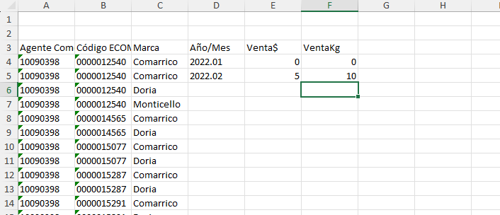

# Requerimiento. 

1. Configurar el entorno. 

- Descargar python 3.12.6 
- Descargar python 3.12.6 embebido
- Traer de la instalación normal : Scripts / Lib / DLLs  (where python : cmd / where.exe python powershell)
- comprimir para uso
- instalar requerimientos. (cd "python-3.12.6-emb") : .\python.exe -m pip install paquete.

2. Leer archivos:  (Insumos/) 
    Universo_Directa.xlsx -> Hoja Maestra: Columnas "A-G"  y Función In.
    Universo_Indirecta.xlsx 
    
    Procesar base socios.

Directa: Complementar información del universo con: 

Base Socios: (Codigo de cliente. )

- Atención
- Tipo Socios
- Cod Jefe: Directa
- Nom Jefe: Directa
- Cod_vend Z1
- Cod_vend Z1
- Nom vend ZA
- Nom vend Z1

Eliminar clientes duplicados en Universo Directa. con base en regla de negocio. 

Para los que son socios revisar: 

    Regla Negocio: Sostener por prioridad Z1 sobre ZA.  (Sobre la base socios.)
    Si hay Z1 elimina ZA
    Si hay ZA pero no Z1 : ZA 
    Agregar status de socio: Col Socio (SI/NO).

Para los que no son socios ( No cruzan con base de socio ): Eliminar Duplicados. con base en la columna codigo de cliente. 

Indirecta : Complementar información del universo con: 

Atención
Tipo Socios
Cod_Agente
Nom_Agente

Driver de cordenada.
1. Leerlo (todo)
2. Procedimiento explicado para traer

Traer del driver de cordenadas: Grado latitud	Grad.long.

Para Indirecta : Cordenadas: [r_id_cliente - equivalente (ECOM) / r_id_agente - equivalente (Agente Comercial)]

Renombrar columnas con base en el Universo. 

Exportar resultado como .xlsx
Exportar resultado como .csv

Pasos:
**Verificar**: Validaciones : paths / columnas / directorios / archivos. 
Carga en memoria: (Archivo)

**Filtrar** : Disminuye la cantidad de información descartando información inutil.  Favorece el procesamiento al contar con data necesaria.

Tratar nulos y duplicados : Muy necesario para no tener interferencias con procesos como: Merge / Group by / Replace , y otras transformaciones. 

Descartar columnas (seleccionar columnas):  Disminuye la cantidad de información descartando información inutil.  Favorece el procesamiento al contar con data necesaria.

Transformaciones. Merge / Group by / Replace , y otras transformaciones

Ventas:

Archivos de Ventas:

- Carpetas Directa e Indirecta:  (Dentro de los insumos)

Leer todos los archivos de ventas de la directa.  Y unirlos todos. (Concatenar)

- Recomendación: filtrar por extensión y no por nombre del archivo. 

- Directorio: "Insumos/Directa/"    

- Hacer un proceso para leer todos los archivos de la carpeta o iterar sobre todos los archivos. 

Cliente 	v$ Comarritco 	vKg Comarrico 	VkG Doria	V$Doria (Ventas totates)

(Lo que mas pueda viernes.)

Pendiente: Martes.
- Arreglar formato de la indirecta
- Ajustar Directa. (Utilizar la función lectura_excel_columnas para  leer cada df)
- No duplicar logica de leer varios archivos / no  haga dos funciones para  cada modelo dir indir . (retorna : Lista archivos) para directa e indireta. 
- Concatenarlos. Directa de una / Indirecta arreglar formato indirecta pasar a formato directa.

- 
FILTRA POR MARCA: Y RENOMBRAR LAS COLUMNAS DE VENTA SEGÚN LA MARCA. 

Cliente (AGRUPAR POR CLIENTE (DIRECTA)  /  AC Y ECOM (INDIRECTA)). 

v$ Comarritco 	vKg Comarrico 	VkG Doria	V$Doria 

- ADICIONAL SAQUE LAS VALIDACIONES EN UN MÉTODO APARTE. Valide primero dir / archivo etc.

